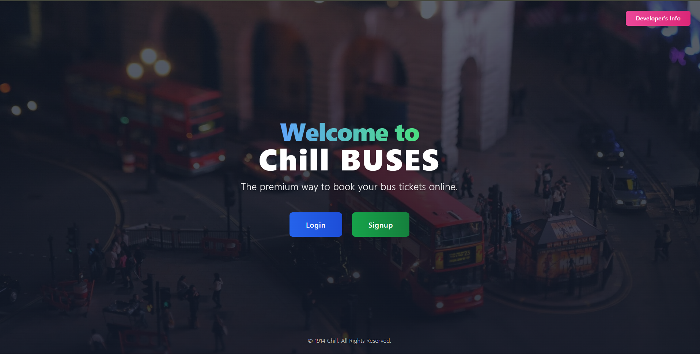
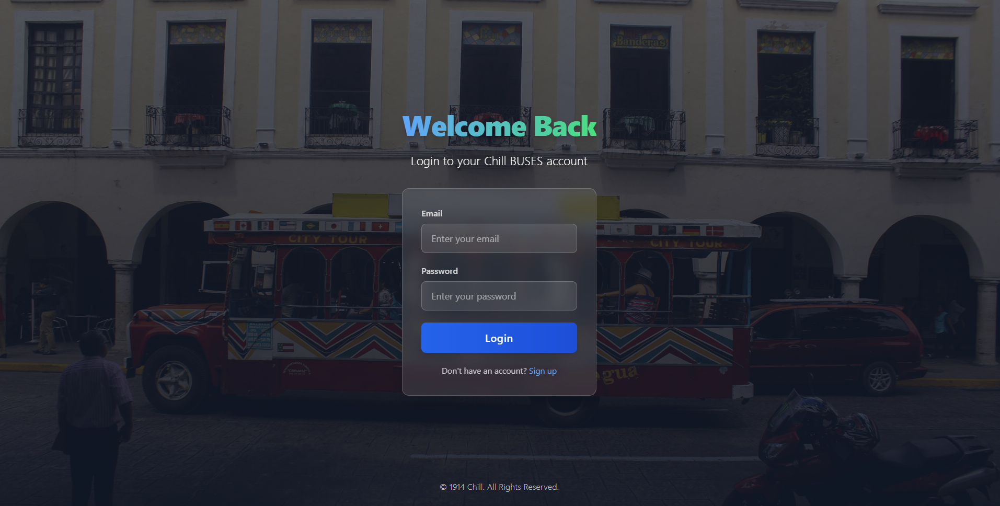
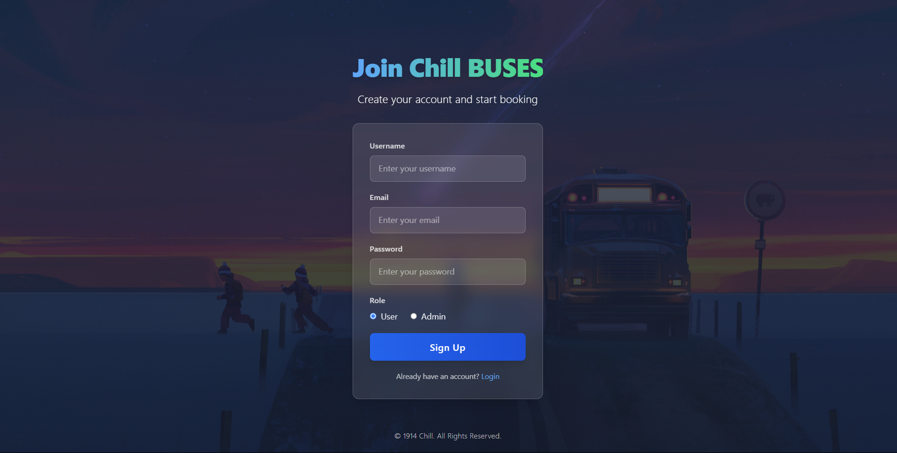
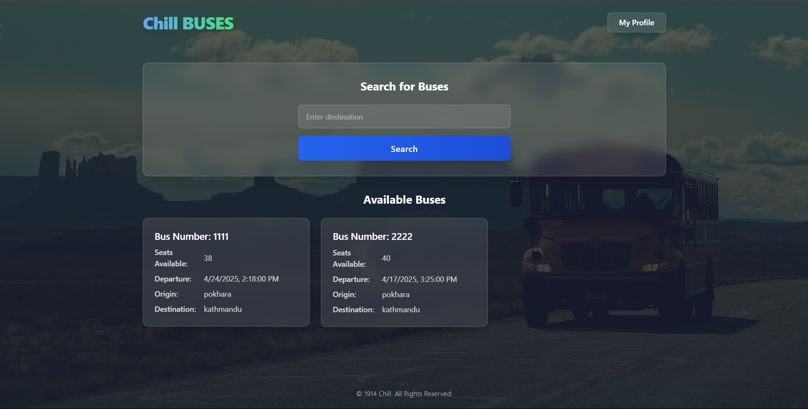
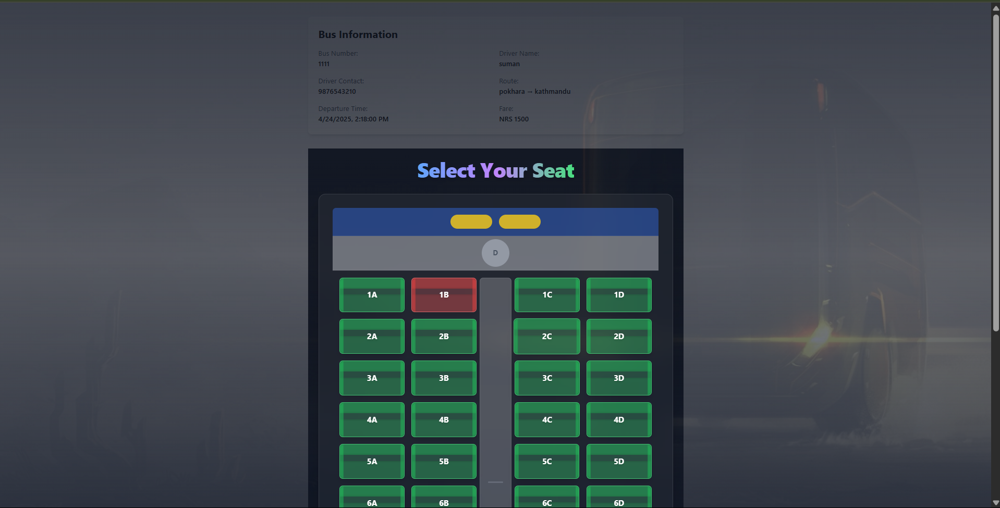
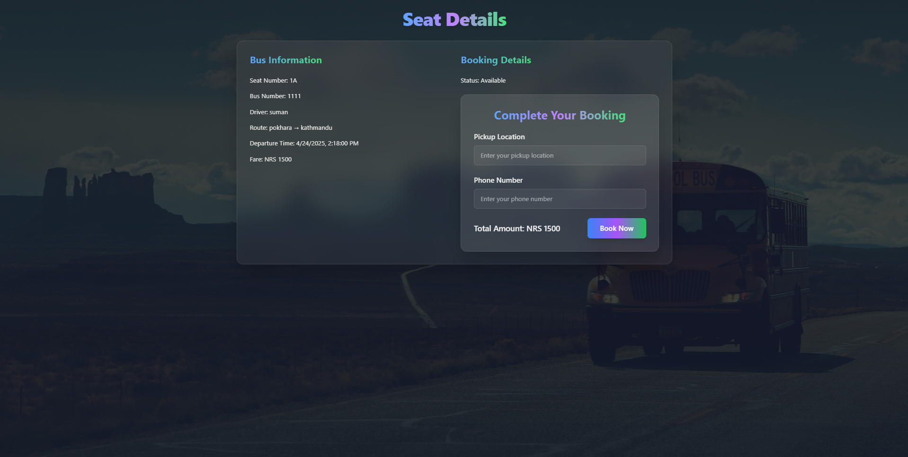
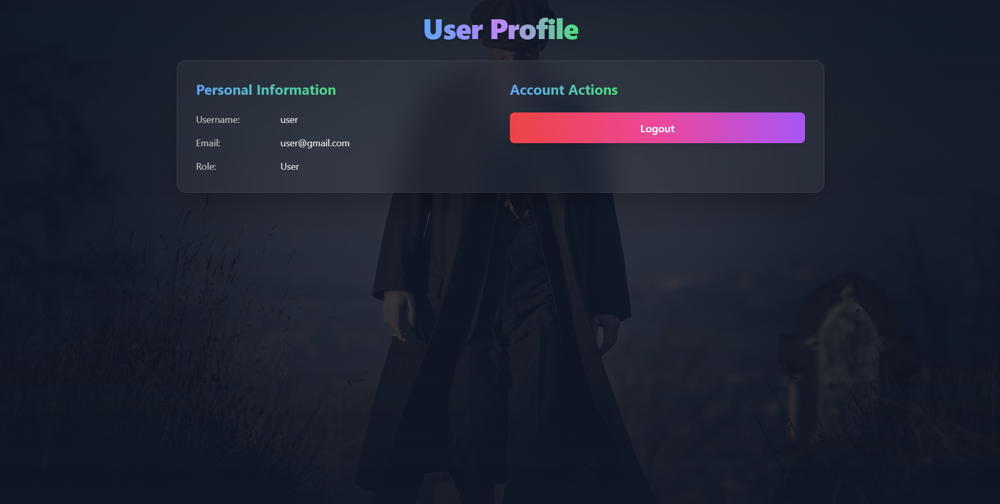
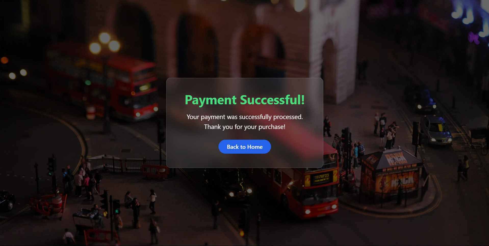
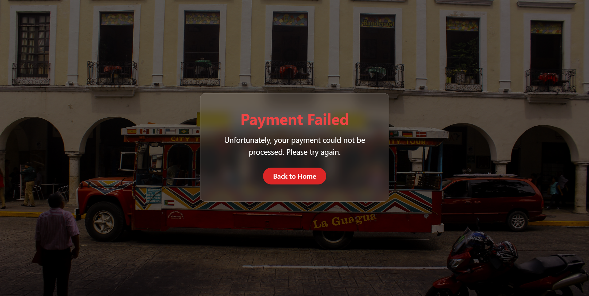

# 🚌 Chill-Buses

**Chill-Buses** is a full-featured bus booking platform that allows administrators to add and manage buses for specific routes, and users to conveniently book seats and pay using **Esewa**, a popular digital payment method in Nepal.

## 🚀 Features

### Admin
- Add new buses and assign them to specific routes.
- Manage schedules and seating availability.

### User
- Browse available buses and routes.
- Select seats and book tickets.
- Pay securely using **Esewa**.

## 📸 Screenshots

### 1. First Page

### 2. Login Page

### 3. Signup Page

### 4. Home Page

### 5. SeatBook page

### 6 . Confirm page

### 7 .  Profile page

### 8 . Esewa Payment

### 9 . Success

### 10 . Failure

